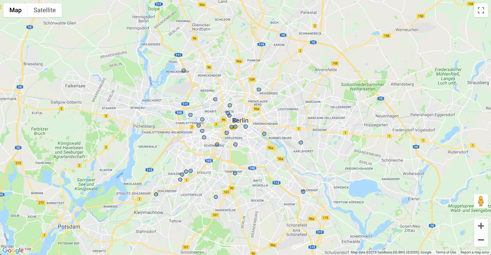

[](http://quantlet.de/)

## [](http://quantlet.de/) **DEDA_Class_2018WS_Berlin_Property_Analysis_Clustering_Universities** [](http://quantlet.de/)

```yaml

Name of Quantlet: 'DEDA_Class_2018WS_Berlin_Property_Analysis_Clustering_Universities'

Published in: 'Digital Economy and Decision Analytics (WS 18/19)'

Description: 'Use HDBSCAN clustering algorithm to cluster spatially heterogeneous university
              points in lat, lng space within Berlin, DE.'

Keywords: 'HDBSCAN, Clustering, Spatial Analysis, Real Estate'

Author: 'Alex Truesdale'

Submitted: 'Sun. Feb 26 2019 by Alex Truesdale'

Datafile: 'universities (csv)'

See also: 'clustering_module.py &
           1) pre_generated/education_universities.html
           2) pre_generated/education_universities.png
           3) runtime_generated/education_universities.html'

```



### PYTHON Code
```python

# -*- coding: utf-8 -*-

"""
Created Jan 11, 2018
@author: Alex Truesdale

Jupyter Notebook for performing spatial clustering on hospital / medical location data.
"""

import os
import time
import gmplot
import pandas as pd
import clustering_module as clusterer

# Introduction.
print('==================================================================================')
print("\n This script reads in university spatial data collected for this project. \n \
The data selection here contains the lat, lng coordinates of all university \n \
locations in the city. These points are then clustered using the HDBSCAN \n \
algorithm, plotted on a Google Maps instance, and written to an HTML file, \n \
which can be opened in your browser. \n")
print('==================================================================================')
print()
time.sleep(7)

# Search for all university data; return as list of objects; create coordinate matrix of points.
print("------ reading data from 'universities.csv' as lat, lng values")
universities_df = pd.read_csv('universities.csv')
universities_coords = universities_df[['lat', 'lng']].values
time.sleep(1)

# First pass of clustering (greedy).
print("------ count of university locations: {}".format(len(universities_coords)))
time.sleep(2)

print("------ running clustering module (first pass)")
time.sleep(1.5)

clusters, clustered_locations = clusterer.clusterer(universities_coords,
                                                    universities_df,
                                                    min_cluster_size = 2,
                                                    min_samples = 2,
                                                    first_run = True)

time.sleep(1.5)

# Find centremost points of clusters; reorder into new matrix.
print("------ find centremost points of clusters (pass again to clusterer) \n")
time.sleep(1)
centremost_points = clusters.map(clusterer.get_centermost_point)
centremost_df = pd.DataFrame(list(centremost_points), columns = ['lat', 'lng'])
centremost_coords = centremost_df[['lat', 'lng']].values
time.sleep(1)

# Second pass of clustering to cluster the clusters.
print("------ running clustering module (second pass)")
time.sleep(1.5)

clusters_c, clustered_locations_c = clusterer.clusterer(centremost_coords,
                                                        universities_df,
                                                        min_cluster_size = 2,
                                                        min_samples = 2,
                                                        first_run = False)

time.sleep(1.5)

# Find centremost points of new clusters.
print("------ find centremost points of clusters")
time.sleep(1)
centremost_points_c = clusters_c.map(clusterer.get_centermost_point)
time.sleep(1)

# Identify non-clustered clusters.
dict_centroids = {i: list(centroid) for i, centroid in enumerate(centremost_points)}
non_clustered_centroids = [[cluster[0], cluster[1]] for cluster in dict_centroids.values() if cluster not in clustered_locations_c]

dict_centroids_final = {i: list(centroid) for i, centroid in enumerate(centremost_points_c)}
non_clustered_dict = {len(dict_centroids_final) + i: centroid for i, centroid in enumerate(non_clustered_centroids)}
dict_centroids_final.update(non_clustered_dict)

# Define lat long coordinate lists.
print("------ collect new and original lat, lng points")
university_lat_list = tuple([school[0] for school in universities_coords])
university_lng_list = tuple([school[1] for school in universities_coords])

centre_lat_list = tuple([point[0] for point in dict_centroids_final.values()])
centre_lng_list = tuple([point[1] for point in dict_centroids_final.values()])
time.sleep(1)

# Change dir. to visualisation dir.
print("------ changing directory to 'runtime_generated' \n")
os.chdir('runtime_generated')
time.sleep(2)

# Initialise map.
print("------ initialising blank map for plotting")
print("------ NOTE: this map will have a 'developer only' banner over it. For \n \
            the maps seen in 'pre_generated/output_maps', one must have \n \
            a valid Google Cloud project with an API key that is  \n \
            provisioned for using the JavaScript Maps API. \n")

time.sleep(6)

raw_map_out = gmplot.GoogleMapPlotter(52.5112264, 13.415641, 10.81)

# Plot scatter points.
print("------ plotting points: original and university cluster centroids")
raw_map_out.scatter(university_lat_list, university_lng_list, '#6A5ACD', size = 130, marker = False)
raw_map_out.scatter(centre_lat_list, centre_lng_list, '#07B3BC', size = 230, marker = False)
time.sleep(1.5)

# Trigger write / compile method to create final map.
raw_map_out.draw("education_universities.html")
print("------ saving map as: 'education_universities.html' in 'runtime_generated' \n")
time.sleep(.5)

```

automatically created on 2019-03-01