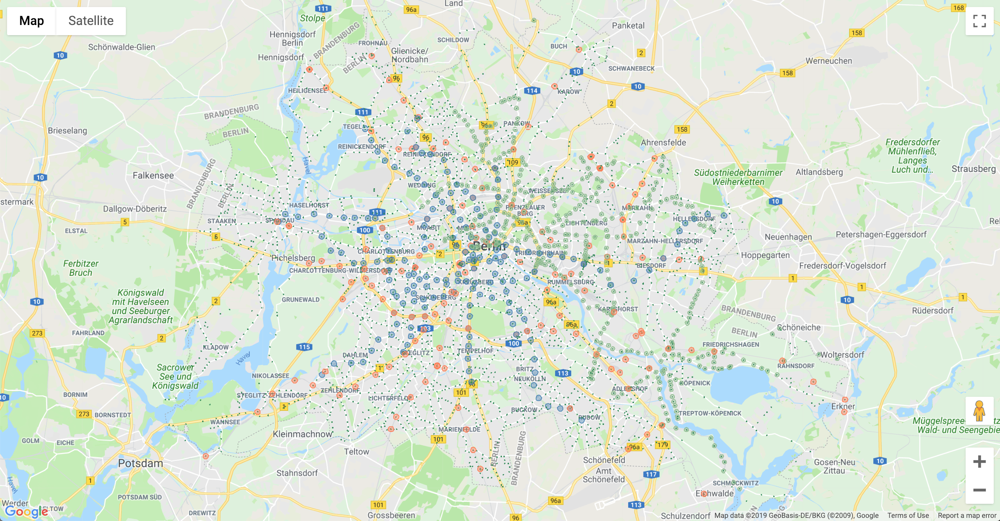
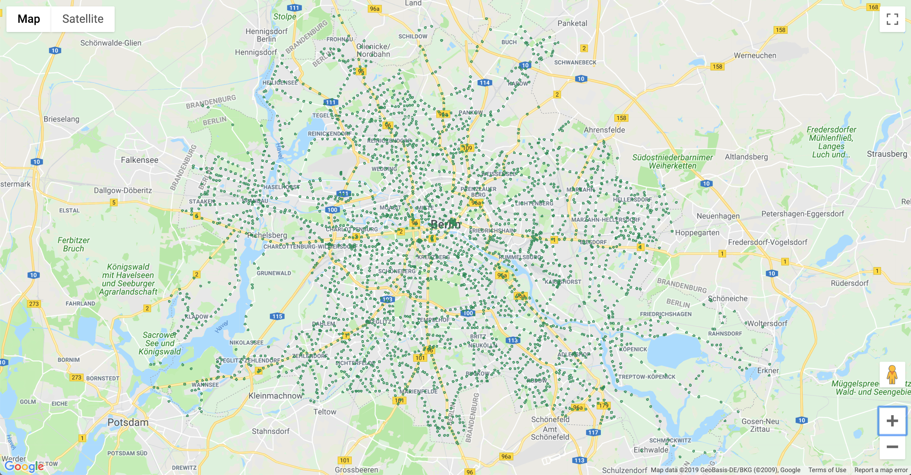
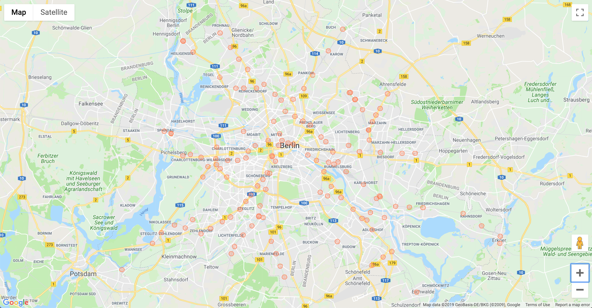
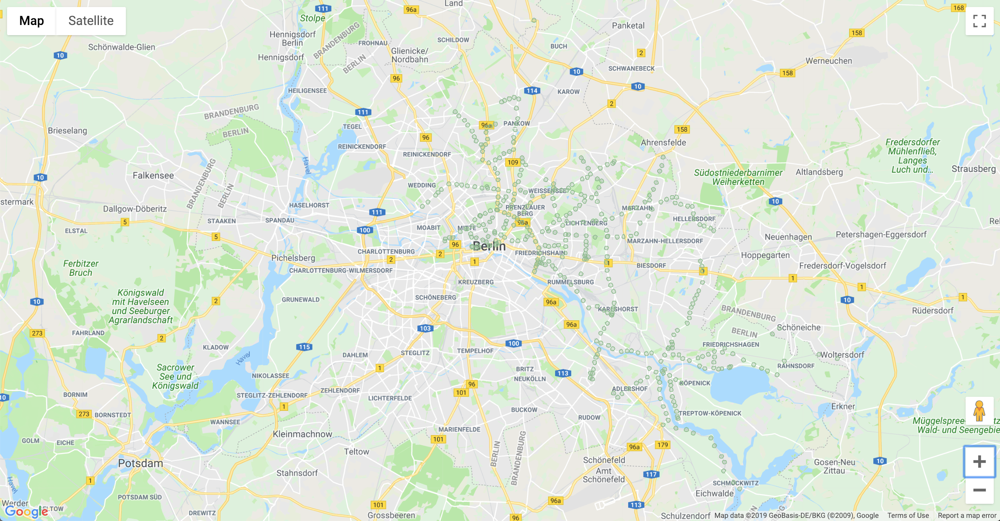
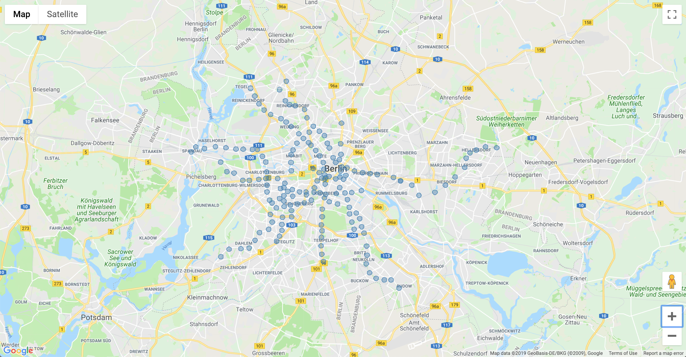

[](http://quantlet.de/)

## [](http://quantlet.de/) **DEDA_Class_2018WS_Berlin_Property_Analysis_Gmap_Plotter** [](http://quantlet.de/)

```yaml

Name of Quantlet: 'DEDA_Class_2018WS_Berlin_Property_Analysis_Gmap_Plotter'

Published in: 'Digital Economy and Decision Analytics (WS 18/19)'

Description: 'Example Quantlet for charting spatial data collected for this
              project. This file plots all transit data for the city of Berlin, DE.'

Keywords: 'Spatial Analysis, Transit Data, Real Estate, Data Visualisation'

Author: 'Alex Truesdale'

Submitted: 'Sun. Feb 26 2019 by Alex Truesdale'

Datafile: 'transit_points (xlsx)'

See also: '1) pre_generated/html_renderings/*.html
           2) pre_generated/output_maps/*.png
           3) runtime_generated/html_renderings/*.html'

```











### PYTHON Code
```python

# -*- coding: utf-8 -*-

"""
Created Jan 13, 2018
@author: Alex Truesdale

Jupyter Notebook for charting output from transportation location data.
"""

import os
import sys
import openpyxl
import pandas as pd
import time
import gmplot

# Introduction.
print('==================================================================================')
print("\n This script reads in a selection of spatial data collected for this project. \n \
The data selection here contains the lat, lng coordinates of all transit \n \
points in the city. These points are then plotted on a Google Maps instance \n \
and written to an HTML file, which can be opened in your browser. \n")
print('==================================================================================')
print()
time.sleep(7)

print("------ reading data from 'transit_points.xlsx'")
data_workbook = pd.ExcelFile('transit_points.xlsx')
df_sbahn = pd.read_excel(data_workbook, 'sbahn', header = None)
df_ubahn = pd.read_excel(data_workbook, 'ubahn', header = None)
df_bus = pd.read_excel(data_workbook, 'bus', header = None)
df_tram = pd.read_excel(data_workbook, 'tram', header = None)
time.sleep(1)

print("------ see data format (first 20 rows of SBahn locations):", '\n')
time.sleep(3)

print(df_sbahn.head(20), '\n')
time.sleep(2)

# Define lat / lng collections (tuples).
sbahn_lat_list = tuple(list(df_sbahn[0]))
sbahn_lng_list = tuple(list(df_sbahn[1]))

ubahn_lat_list = tuple(list(df_ubahn[0]))
ubahn_lng_list = tuple(list(df_ubahn[1]))

bus_lat_list = tuple(list(df_bus[0]))
bus_lng_list = tuple(list(df_bus[1]))

tram_lat_list = tuple(list(df_tram[0]))
tram_lng_list = tuple(list(df_tram[1]))

# Change dir. to visualisation dir.
print("------ changing directory to 'runtime_generated/html_renderings' \n")
os.chdir('runtime_generated/html_renderings/')
time.sleep(2)

# Initialise raw map with api key.
# key_02 = 'xxxxxxxxxxxxxx'
# raw_map_all = gmplot.GoogleMapPlotter(52.5112264, 13.415641, 10.81, apikey = key_02)

print("------ initialising 5 blank maps for plotting")
print("------ NOTE: this map will have a 'developer only' banner over it. For \n \
            the maps seen in 'pre_generated/output_maps', one must have \n \
            a valid Google Cloud project with an API key that is  \n \
            provisioned for using the JavaScript Maps API. \n")

time.sleep(6)

# Initialise raw maps.
raw_map_bus = gmplot.GoogleMapPlotter(52.5112264, 13.415641, 10.81)
raw_map_tram = gmplot.GoogleMapPlotter(52.5112264, 13.415641, 10.81)
raw_map_ubahn = gmplot.GoogleMapPlotter(52.5112264, 13.415641, 10.81)
raw_map_sbahn = gmplot.GoogleMapPlotter(52.5112264, 13.415641, 10.81)
raw_map_all = gmplot.GoogleMapPlotter(52.5112264, 13.415641, 10.81)

# Plot scatter points for bus points.
print("------ plotting points: bus stops")
raw_map_bus.scatter(bus_lat_list, bus_lng_list, '#2E8B57', size = 75, marker = False)
time.sleep(.5)

# Trigger write / compile method to create final map.
raw_map_bus.draw('transport_bus.html')
print("------ saving map as: 'transport_bus.html' in 'runtime_generated/html_renderings' \n")
time.sleep(.5)

# Plot scatter points for tram points.
print("------ plotting points: tram stops")
raw_map_tram.scatter(tram_lat_list, tram_lng_list, '#8FBC8F', size = 140, marker = False)
time.sleep(.5)

# Trigger write / compile method to create final map.
raw_map_tram.draw('transport_tram.html')
print("------ saving map as: 'transport_tram.html' in 'runtime_generated/html_renderings' \n")
time.sleep(.5)

# Plot scatter points for ubahn points.
print("------ plotting points: ubahn stops")
raw_map_ubahn.scatter(ubahn_lat_list, ubahn_lng_list, '#4682B4', size = 190, marker = False)
time.sleep(.5)

# Trigger write / compile method to create final map.
raw_map_ubahn.draw('transport_ubahn.html')
print("------ saving map as: 'transport_ubahn.html' in 'runtime_generated/html_renderings' \n")
time.sleep(.5)

# Plot scatter points for sbahn points.
print("------ plotting points: sbahn stops")
raw_map_sbahn.scatter(sbahn_lat_list, sbahn_lng_list, '#FF7F50', size = 190, marker = False)
time.sleep(.5)

# Trigger write / compile method to create final map.
raw_map_sbahn.draw('transport_sbahn.html')
print("------ saving map as: 'transport_sbahn.html' in 'runtime_generated/html_renderings' \n")
time.sleep(.5)

# Plot scatter points for all transit types.
print("------ plotting points: all transit")
raw_map_all.scatter(tram_lat_list, tram_lng_list, '#8FBC8F', size = 140, marker = False)
raw_map_all.scatter(sbahn_lat_list, sbahn_lng_list, '#FF7F50', size = 190, marker = False)
raw_map_all.scatter(ubahn_lat_list, ubahn_lng_list, '#4682B4', size = 190, marker = False)
raw_map_all.scatter(bus_lat_list, bus_lng_list, '#2E8B57', size = 75, marker = False)
time.sleep(.5)

# Trigger write / compile method to create final map.
raw_map_all.draw('transport_all.html')
print("------ saving map as: 'transport_all.html' in 'runtime_generated/html_renderings' \n")
time.sleep(.5)

```

automatically created on 2019-03-01