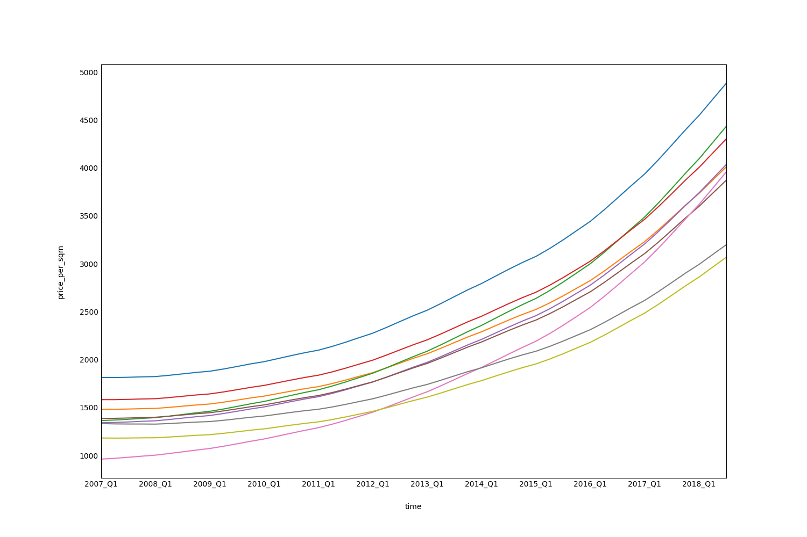

[](http://quantlet.de/)

## [](http://quantlet.de/) **DEDA_Class_2018WS_Berlin_Property_Analysis_Growth_Plot** [](http://quantlet.de/)

```yaml

Name of Quantlet: 'DEDA_Class_2018WS_Berlin_Property_Analysis_Growth_Plot'

Published in: 'Digital Economy and Decision Analytics (WS 18/19)'

Description: 'Plotting script for visualising the growth in property sale
              prices in Berlin, DE over the last 11 years (by district).'

Keywords: 'Time Series Data, Real Estate, Data Visualisation'

Author: 'Alex Truesdale'

Submitted: 'Sun. Feb 26 2019 by Alex Truesdale'

Datafile: 'price history (csv)'

See also: 'output_charts/*.png'

```



### PYTHON Code
```python

# -*- coding: utf-8 -*-

"""
Created Jan 28, 2018
@author: Alex Truesdale

Jupyter Notebook for plotting price growth over time.
"""

import re
import os
import time
import numpy as np
import pandas as pd
import matplotlib.pyplot as plt

# Introduction.
print('==================================================================================')
print("\n This script collects the Berlin price history notebook in the same directory. \n \
It then parses the table based on pre- determined 'areas of interest' and \n \
produces line charts for each, plotting real estate price growth over time. \n")
print('==================================================================================')
print()
time.sleep(7)

# Set matplotlib settings.
plt.style.use('default')

# Read in data set.
print("------ reading data from 'price_history.csv'")
price_history_df = pd.read_csv('price_history.csv')
time.sleep(1)

print("------ see first 20 rows of data:", '\n')
time.sleep(2)

print(price_history_df.head(20), '\n')
time.sleep(2)

# Change directory to output dir.
print("------ changing directory to 'output'")
os.chdir('output_charts/')
time.sleep(1)

print("------ charting all districts:", '\n')
time.sleep(.4)

for i, location in enumerate(list(price_history_df['location'].unique())):
    print(str(i) + ' of ' + str(len(list(price_history_df['location'].unique()))) + ':',  location)
    time.sleep(.2)

print()
print("------ saving plot and legend as 'price_all_districts.png' & 'price_all_districts_labels.png'")
time.sleep(2)

# Construct price growth chart for all districts (must be run in block).
fig, ax = plt.subplots(figsize = (15, 10))
for location in price_history_df.location.unique():
    ax.plot(price_history_df[price_history_df.location == location].time, price_history_df[price_history_df.location == location].value, label = location)

handles, labels = ax.get_legend_handles_labels()

ax.set_xlabel('time', labelpad = 20)
for n, label in enumerate(ax.xaxis.get_ticklabels()):
    if n % 4 != 0:
        label.set_visible(False)

ax.tick_params(axis = u'both', which = u'both',length=0)

plt.margins(x = 0)
ax.set_ylabel('price_per_sqm', labelpad = 20)
ax.set_title('Price Per Metre Sq. by Quarter by Year')
title = ax.title
title.set_position([.5, 1.015])
fig.savefig('price_all_districts.png', transparent = True)

# Construct labels image from above plot (must be run in block).
fig_legend = plt.figure(figsize = (5.5, 22.5))
axi = fig_legend.add_subplot(111)
fig_legend.legend(handles, labels, loc = 'center', scatterpoints = 1)
axi.xaxis.set_visible(False)
axi.yaxis.set_visible(False)
fig_legend.canvas.draw()
fig_legend.savefig('price_all_districts_labels.png', transparent = True)
time.sleep(2)

# Define of-interest districts list.
interest_list = [
    'Mitte',
    'Charlottenburg',
    'Kreuzberg',
    'Prenzlauer Berg',
    'Schöneberg',
    'Friedrichshain',
    'Wilmersdorf',
    'Neukölln',
    'Tiergarten',
    'Steglitz',
    'Friedenau',
    'Tempelhof',
    'Zehlendorf',
    'Wedding',
    'Pankow',
    'Treptow',
    'Weißensee',
    'Lichtenberg'
]

print("------ charting trimmed list of districts:", '\n')
time.sleep(.4)

for i, location in enumerate(interest_list):
    print(str(i) + ' of ' + str(len(interest_list)) + ':',  location)
    time.sleep(.35)

print()
print("------ saving plot and legend as 'price_trimmed_districts.png' & 'price_trimmed_districts_labels.png'")
time.sleep(2)

# Construct price growth chart for of-interest districts (must be run in block).
fig, ax = plt.subplots(figsize = (15, 10))
for location in interest_list:
    ax.plot(price_history_df[price_history_df.location == location].time, price_history_df[price_history_df.location == location].value, label = location)

handles, labels = ax.get_legend_handles_labels()

ax.set_xlabel('time', labelpad = 20)
for n, label in enumerate(ax.xaxis.get_ticklabels()):
    if n % 4 != 0:
        label.set_visible(False)

ax.tick_params(axis=u'both', which=u'both',length=0)

plt.margins(x = 0)
ax.set_ylabel('price_per_sqm', labelpad = 20)
ax.set_title('Price Per Metre Sq. by Quarter by Year')
title = ax.title
title.set_position([.5, 1.015])
fig.savefig('price_trimmed_districts.png', transparent = True)

# Construct labels image from above plot (must be run in block).
fig_legend = plt.figure(figsize = (4.5, 6.5))
axi = fig_legend.add_subplot(111)
fig_legend.legend(handles, labels, loc = 'center', scatterpoints = 1)
axi.xaxis.set_visible(False)
axi.yaxis.set_visible(False)
fig_legend.canvas.draw()
fig_legend.savefig('price_trimmed_districts_labels.png', transparent = True)
time.sleep(2)

# Define of-interest districts list.
interest_list_trimmed = [
    'Mitte',
    'Charlottenburg',
    'Kreuzberg',
    'Prenzlauer Berg',
    'Schöneberg',
    'Friedrichshain',
    'Neukölln',
    'Pankow',
    'Lichtenberg'
]

print("------ charting further trimmed list of districts (inner ring hot spots):", '\n')
for i, location in enumerate(interest_list_trimmed):
    print(str(i) + ' of ' + str(len(interest_list_trimmed)) + ':',  location)
    time.sleep(.5)

print()
print("------ saving plot and legend as 'price_inner_city_districts.png' & 'price_inner_city_districts_labels.png'")
time.sleep(2)

# Construct price growth chart for trimmed of-interest districts (must be run in block).
fig, ax = plt.subplots(figsize = (15, 10))
for location in interest_list_trimmed:
    ax.plot(price_history_df[price_history_df.location == location].time, price_history_df[price_history_df.location == location].value, label = location)

handles, labels = ax.get_legend_handles_labels()

ax.set_xlabel('time', labelpad = 20)
for n, label in enumerate(ax.xaxis.get_ticklabels()):
    if n % 4 != 0:
        label.set_visible(False)

ax.tick_params(axis=u'both', which=u'both',length=0)

plt.margins(x = 0)
ax.set_ylabel('price_per_sqm', labelpad = 20)
title = ax.title
title.set_position([.5, 1.015])
fig.savefig('price_inner_city_districts.png', transparent = True)

# Construct labels image from above plot (must be run in block).
fig_legend = plt.figure(figsize = (4.5, 3.5))
axi = fig_legend.add_subplot(111)
fig_legend.legend(handles, labels, loc = 'center', scatterpoints = 1)
axi.xaxis.set_visible(False)
axi.yaxis.set_visible(False)
fig_legend.canvas.draw()
fig_legend.savefig('price_inner_city_districts_labels.png', transparent = True)

```

automatically created on 2019-03-01